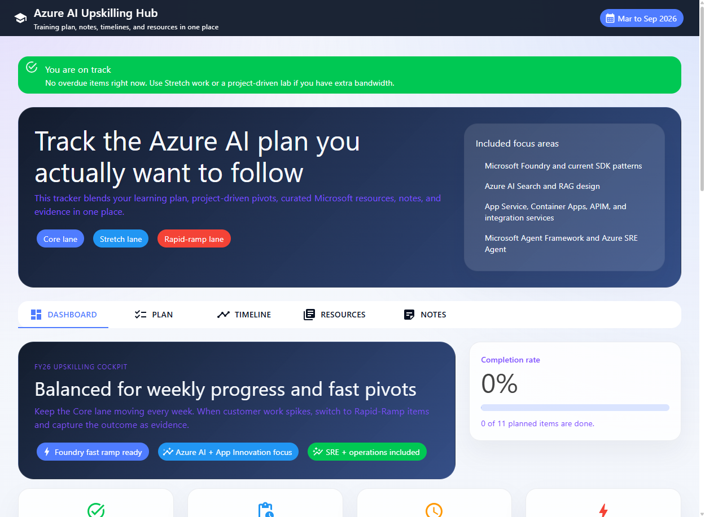

## Overview

This repository contains a small Blazor-based training tracker for Azure AI and
App Innovation learning.

## High-level architecture

The app is organized as a lightweight interactive Blazor experience hosted on
Azure App Service.

* The browser loads a Blazor web app protected by Azure App Service Authentication.
* Feature views for Dashboard, Plan, Timeline, Resources, and Notes run through
   a shared `TrackerService`.
* EF Core writes training data, resources, and notes into a SQLite database.
* GitHub Actions builds the app and deploys `main` to the Azure web app.

For the Mermaid version of the architecture, see [arch.md](arch.md).

## Portal screenshot



It is designed to help you:

* Track plan items, notes, evidence, and timelines
* Add new work as customer projects shift priorities
* Keep a reusable resource library for Microsoft Foundry, GitHub Copilot,
  App Service, Container Apps, and related topics
* Run locally first and deploy easily to Azure App Service
* Push updates through GitHub Actions CI/CD

## Main app features

* Dashboard with completion and focus metrics
* Planner tab for adding and editing training items
* Timeline tab grouped by month
* Resources tab with editable sections and links
* Notes tab for reflections, architecture notes, and lab takeaways
* Microsoft Entra sign-in enforced by Azure App Service Authentication
* Seeded content for the March to September 2026 plan, including Azure SRE Agent

## Local development

1. Restore dependencies:

   ```powershell
   dotnet restore .\src\UpskillTracker\UpskillTracker.csproj
   ```

2. Run the app:

   ```powershell
   dotnet run --project .\src\UpskillTracker\UpskillTracker.csproj
   ```

3. Open the local URL shown in the terminal.

The app stores its SQLite database in the local `Data` folder by default.

Local development does not enforce App Service Authentication. Authentication is
applied by Azure App Service in the deployed environment.

## Azure deployment

The easiest deployment path is now `azd`.

### Recommended: one-command deployment with azd

1. Sign in first:

   ```powershell
   az login
   azd auth login
   ```

2. From the repository root, run:

   ```powershell
   .\scripts\deploy-azd.ps1 -EnvironmentName personal-learning -Location eastus2 -ResourceGroupName rg-personal-learning -WebAppName <unique-web-app-name>
   ```

3. For later updates, rerun the same command or use:

   ```powershell
   azd deploy
   ```

The wrapper runs `azd provision` and `azd deploy` as separate steps so failures
are easier to identify.

The `azd` path uses these files:

* [azure.yaml](azure.yaml)
* [infra/main.bicep](infra/main.bicep)
* [infra/resources.bicep](infra/resources.bicep)
* [infra/main.parameters.json](infra/main.parameters.json)
* [scripts/deploy-azd.ps1](scripts/deploy-azd.ps1)

This deployment provisions:

* Azure App Service plan
* Linux App Service web app
* Log Analytics workspace
* Application Insights

### Common azd auth issue

If deployment appears stuck around `Initialize bicep provider` or you see an
AAD refresh token expiration error, refresh the Azure Developer CLI login and
run the wrapper again:

```powershell
azd auth login
```

If browser login is inconvenient, use device code:

```powershell
.\scripts\deploy-azd.ps1 -EnvironmentName personal-learning -Location eastus2 -ResourceGroupName rg-personal-learning -WebAppName <unique-web-app-name> -UseDeviceCode
```

### Microsoft.Web gateway timeout during azd deploy

If `azd deploy` fails while checking App Service deployment history with a
`504 Gateway Timeout` from `Microsoft.Web`, the wrapper now falls back to a
direct zip deployment to the existing App Service.

This means you can rerun the same command and let the script continue with the
fallback path automatically.

It also configures these app settings:

* `APPLICATIONINSIGHTS_CONNECTION_STRING`
* `ASPNETCORE_ENVIRONMENT=Production`
* `Storage__ConnectionString=Data Source=/home/data/upskilltracker.db`
* `WEBSITES_ENABLE_APP_SERVICE_STORAGE=true`

### Direct deployment script

If you prefer Azure CLI without `azd`, this script is still available and now
resolves paths correctly even when run from the `scripts` folder:

```powershell
.\scripts\deploy-azure.ps1 -ResourceGroupName rg-upskilltracker -WebAppName <unique-web-app-name>
```

## GitHub Actions CD setup

After the first Azure deployment:

1. Create a Microsoft Entra app registration or user-assigned identity for
   GitHub Actions OpenID Connect access.
2. Grant the identity access to the App Service deployment scope.
3. Add these GitHub Actions secrets:

   * `AZURE_CLIENT_ID`
   * `AZURE_TENANT_ID`
   * `AZURE_SUBSCRIPTION_ID`
   * `APPSERVICE_AUTH_CLIENT_SECRET`

4. Add these repository variables:

   * `AZURE_WEBAPP_NAME`
   * `APPSERVICE_AUTH_CLIENT_ID`
   * `APPSERVICE_AUTH_ALLOWED_USER_ID`

5. Push to `main` or run the CD workflow manually.

This repository now uses OpenID Connect for GitHub Actions CD instead of a
publish profile, which avoids basic authentication and aligns with App Service
policy restrictions.

The CD workflow also applies App Service Authentication through Bicep so the
site requires Microsoft Entra sign-in in Azure.

## Repository automation

* CI workflow: [.github/workflows/ci.yml](.github/workflows/ci.yml)
* CD workflow: [.github/workflows/cd.yml](.github/workflows/cd.yml)
* Azure deployment script: [scripts/deploy-azure.ps1](scripts/deploy-azure.ps1)
* Publish profile helper: [scripts/get-publish-profile.ps1](scripts/get-publish-profile.ps1)
