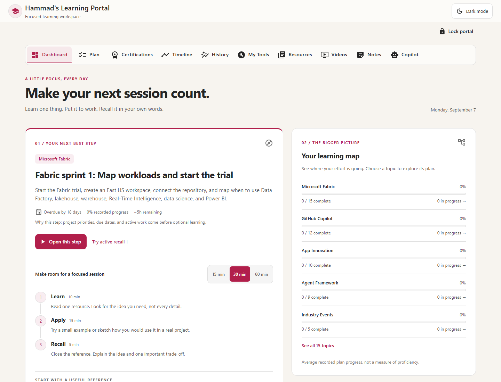
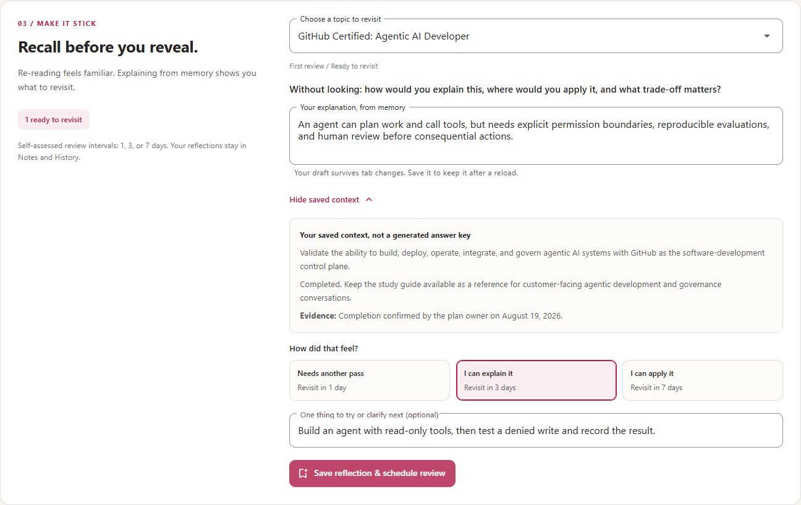

# Hammad's Learning Portal

## Overview

This repository contains a Blazor-based learning hub for Azure AI and App
Innovation upskilling. It combines a structured training tracker, a live
dual-stream announcement experience, and an in-app GitHub Copilot chat
experience that is grounded in your saved plan, notes, and resources.

## High-level architecture

The app is organized as a lightweight interactive Blazor experience hosted on
Azure App Service.

* Server-side PIN authorization protects pages, HTTP mutations, and Blazor circuit events; the browser receives an expiring HttpOnly session cookie rather than an unlock flag.
* Feature views for Dashboard, Plan, Certifications, Timeline, Learning History, My Tools, Resources, Notes, and Copilot run
   through shared application services.
* `AnnouncementFeedService` loads and caches both official Microsoft updates and
  curated thought-leader or industry posts for the dashboard feed.
* `CopilotAuthService` and `CopilotChatService` manage in-app GitHub OAuth and
  grounded Copilot chat sessions.
* EF Core writes training data, learning activity, resources, and notes to SQLite locally and Azure
  Database for PostgreSQL Flexible Server in production.
* GitHub Actions builds the app and deploys `main` to the Azure web app.

For the Mermaid version of the architecture, see [arch.md](arch.md).

## Portal screenshot





It is designed to help you:

* Track plan items, certification goals, notes, evidence, and timelines
* Add new work as customer projects shift priorities
* Separate overdue and core commitments from nice-to-have learning so the next action is clear
* Revisit completed work, useful reads, watched videos, reflections, and tool sessions in a month-by-month learning history
* Launch the Azure, Foundry, and GitHub hubs maintained at [hammadaslam.com/tools-and-demos](https://hammadaslam.com/tools-and-demos/)
* Review a live dashboard feed that switches between Microsoft updates and curated industry posts that matter to your plan
* Keep a reusable resource library for Microsoft Foundry, GitHub Copilot,
  App Service, Container Apps, and related topics
* Ask grounded GitHub Copilot questions against your saved learning data
* Run locally first and deploy easily to Azure App Service
* Push updates through GitHub Actions CI/CD

## Main app features

### Long-term LLM foundations

The plan includes a Stretch sequence from Andrej Karpathy, after the existing Python
foundations work. Suggested dates are adjustable; budgets assume roughly two hours
per week and include viewing, coding, debugging, and reflection.

| Target | Project and official repository | Approx. video length | Planned effort |
| --- | --- | --- | --- |
| January 29, 2027 | [Build micrograd](https://github.com/karpathy/micrograd) | 2.5 hours | 8 hours |
| March 26, 2027 | [Let's build GPT from scratch](https://github.com/karpathy/ng-video-lecture) | 2 hours | 16 hours |
| May 7, 2027 | [Build the GPT tokenizer (minbpe)](https://github.com/karpathy/minbpe) | 2.25 hours | 10 hours |
| July 30, 2027 | [Reproduce GPT-2 (124M), optional capstone](https://github.com/karpathy/build-nanogpt) | 4 hours | 24 hours |

The small GPT project builds a character-level Shakespeare generator; the GPT-2
reproduction is a separate, advanced follow-on. The first three items total **34
hours**, or **58 hours** with the optional capstone. These are planning estimates,
not published course completion times; prerequisite study and unattended training
are extra. Use reduced models for learning and budget full GPU runs separately.
The [Zero to Hero curriculum](https://github.com/karpathy/nn-zero-to-hero) provides
the makemore prerequisites if PyTorch tensors and language-model training are new.
Each plan item includes its video link, prerequisites, and completion criteria,
with companion repositories available under **Resources → LLM Foundations**.
In **Plan**, select **Nice to have** or **All work** and search for **Karpathy**;
the default **Do next** filter intentionally excludes this long-term Stretch work.
The sequence is added once to both new and existing databases without overwriting
matching items or re-adding items deleted after the update.

### Feature overview

* A focused learning dashboard with a ranked next step, matching references, and a visual Learn / Apply / Recall session guide for 15, 30, or 60 minutes
* An interactive topic map with average recorded progress and completion counts; each topic opens its exact Plan filter
* Active recall grounded in your own plan descriptions, notes, and evidence, with self-assessed 1-, 3-, or 7-day review intervals
* Recall drafts that survive tab changes during the current visit, plus saved reflections in Notes and durable Learning History
* A browser-local weekly activity chart that emphasizes consistency without streak pressure
* Compact, actionable core-completion, schedule-risk, and due-soon metrics
* Compact 12-week learning contribution calendar and recent-achievement preview on the Dashboard
* A consistent warm light / charcoal dark theme, visible keyboard focus, reduced-motion support, and responsive learning cards
* Bookmarkable tabs through `?view=plan`, `?view=notes`, and the other workspace views, with browser back/forward support
* Dual announcement streams with Microsoft updates and thought-leader or industry posts, paged for faster scanning with actions to open and save useful updates
* Planner tab with a responsive card layout, a dedicated 10-business-day Fabric sprint, an announcement-event runway, focus filters, and direct task links suggested from the shared resource library
* Certifications tab for tracking target dates, progress, status, preparation notes, and evidence, with a direct Mark complete action
* Curated certification import catalog for Microsoft, GitHub, and Databricks credentials
* Timeline tab grouped by month
* Learning History tab with an accessible one-year activity calendar, active-day and milestone metrics, day details, filters, and a month/year narrative
* My Tools tab linking to the Azure Integration Hub, Microsoft Foundry Updates Portal, GitHub Enterprise Admin Hub, and GitHub Agentic Workflows Lab
* Resources tab with editable sections and links that power task-level suggestions across the app
* Notes tab with readable multi-line reflections, immediate search, and confirmation before deleting personal learning data
* Copilot tab with GitHub OAuth sign-in, runtime model discovery, and tracker-grounded chat tools
* Server-verified PIN login backed by a secure Azure app setting, expiring sessions, antiforgery protection, rate limiting, and cross-tab locking
* Urgent Microsoft Fabric ramp targeting August 20 through September 2, 2026, using the public NYC Taxi dataset for an ingestion-to-insight OpenText-ready capstone
* Post-trip Fabric expert track through DP-600, plus dated Microsoft Build, GitHub Universe, and Microsoft Ignite announcement reviews
* GH-600 GitHub Certified: Agentic AI Developer recorded as completed and AI-103 rescheduled to follow the urgent Fabric work

## UI notes

The dashboard gives learning actions priority over reporting and backlog pressure.

* The top app bar uses the product name Hammad's Learning Portal and no hardcoded date badge
* `LearningStudio` replaces the repeated Home overview, reminder banner, and dashboard urgency cards with one next-step view
* The session guide allocates a chosen time budget across learning, application, and recall; it is not a timer and does not automatically mark work complete
* The learning map is average recorded plan progress, not a proficiency score or an AI assessment
* Recall asks you to explain a concept before revealing your saved context; self-assessments schedule a future review without changing plan completion
* Recall notes use category `Active recall` and structured tags linking the original training item and confidence choice; no new database table or schema migration is required
* Review dates are calculated from the reflection's original creation date in the browser's time zone; editing an old note does not move the review date
* Opening a video moves it to the watch queue, not to completed learning. Only an explicit "Mark as seen" records a watched-video event; existing history is not rewritten
* `learning.css` adapts the existing MudBlazor views to the shared theme. `theme.js` supports system preference, a saved preference, and an explicit `?clawpilotTheme=light` or `dark` override
* Ranked next actions put overdue and near-term core commitments ahead of optional backlog
* Project-driven urgent ramps rank ahead of unrelated recovery work, and the Plan tab shows every Fabric sprint step, deadline, remaining hours, and next action without horizontal scrolling
* Major event cards reserve review windows for Build, GitHub Universe, and Ignite so announcements become a limited set of labs and customer-ready updates
* Core completion excludes nice-to-have work so optional topics do not hide whether committed work is on schedule
* At-risk, due-soon, core, optional, and individual-item actions navigate directly to the matching Plan view
* The forward Timeline excludes completed work, highlights recovery items, and shows planned hours by month
* The learning heatmap uses labeled, keyboard-navigable day cells, opens on recent activity on narrow screens, and treats breaks as neutral rather than punishing a lost streak
* If an Azure deployment replaces an open Blazor Server circuit, the shell shows a reconnect overlay and reloads automatically when the old circuit is rejected
* The dashboard includes a dedicated video watch tracker with queue, seen count, and completion progress
* The announcement section uses a stream switcher so Microsoft updates and curated industry posts stay separate
* The announcement feed starts with six items and offers show-more and show-fewer controls instead of creating an excessively long mobile page
* The learning dashboard renders before external announcement feeds finish; a failed refresh reports a problem instead of erasing the last successful cached feed
* Plan, certification, resource, note, and channel deletion requires confirmation

## Learning history data

The app records durable `LearningActivity` events when you start or advance a plan item, complete work or a certification, open a saved resource or announcement, watch a video, save a reflection, or launch one of your personal tools.

* Existing completion, in-progress, resource, video, announcement, and non-template reflection timestamps are backfilled once when the activity table is introduced.
* Detailed activity from a legacy SQLite database is imported conflict-safely when production uses the configured SQLite-to-PostgreSQL transition path.
* Repeated reads and tool launches are deduplicated per source and day so the calendar reflects meaningful activity rather than click volume.
* Activity titles and details are retained even if the original plan item or resource is later deleted.
* Calendar groupings and displayed activity times use the browser's time zone so late-night learning appears on the intended local day.
* Startup creates the activity table and indexes explicitly for existing SQLite and PostgreSQL databases because this project does not use EF migrations.

## Local development

1. Restore dependencies:

   ```powershell
   dotnet restore .\src\UpskillTracker\UpskillTracker.csproj
   ```

2. Run the app:

   ```powershell
   dotnet run --project .\src\UpskillTracker\UpskillTracker.csproj
   ```

3. Open the local URL shown in the terminal.

Set a local PIN first with user secrets if one is not already configured:

```powershell
dotnet user-secrets set "AccessPin" "<your-local-six-digit-pin>" --project .\src\UpskillTracker\UpskillTracker.csproj
```

The app stores its SQLite database in the local `Data` folder by default.
Production uses Azure Database for PostgreSQL with the web app's managed identity.

Local development uses the configured `AccessPin` value if present. In Azure,
the PIN is stored as an app setting and supplied through deployment secrets, not
hardcoded in source.

### Access and session behavior

The six-digit PIN is verified on the server. Successful entry creates an
eight-hour, non-sliding session cookie (`Secure` in production, `HttpOnly`,
`SameSite=Lax`). Five login attempts are allowed per minute across the app.
Native login, logout, and GitHub confirmation forms use antiforgery tokens.
Announcement writes send the same token in `X-CSRF-TOKEN`.

The PIN session is separate from GitHub Copilot sign-in: a GitHub account alone
does not grant portal access. Locking revokes the session across tabs, and
already-connected circuits recheck access before handling an event.
Sessions and the attempt budget are process-local; app restarts require PIN
entry again. This is a single-instance personal portal, not a multi-user
identity system. Scale-out requires shared session/rate-limit storage and
appropriate Blazor session affinity; MFA requires a real identity provider.

### Regression and browser coverage

```powershell
dotnet test .\tests\UpskillTracker.Tests\UpskillTracker.Tests.csproj --configuration Release
Set-Location .\tests\browser
npm ci
npx playwright install chromium
npm test
```

The browser suite launches its own local app with a temporary SQLite database
and a randomly generated test PIN. It exercises learning navigation, recall
persistence, cancellation of deletion, themes, and all ten tabs at mobile
width. It never connects to the production database. To use an installed Edge
browser locally instead of downloading Chromium, set
`$env:PLAYWRIGHT_CHANNEL = "msedge"` before `npm test`.

CI also runs startup and incremental learning-radar import checks against a
disposable PostgreSQL 16 service, matching production's database provider.
Radar `targetDate` values use the schema's `yyyy-MM-dd` format and are stored
as UTC midnight without changing the intended calendar date.

To include PostgreSQL coverage locally, point the tests at a disposable server:

```powershell
$env:POSTGRES_TEST_CONNECTION_STRING = "Host=127.0.0.1;Port=5432;Database=postgres;Username=postgres;Password=<local-test-password>;SSL Mode=Disable"
dotnet test .\tests\UpskillTracker.Tests\UpskillTracker.Tests.csproj --configuration Release --filter FullyQualifiedName~LearningRadarInitializationTests
```

The fixture accepts only loopback hosts and creates and removes its own uniquely
named test database. Without this variable, PostgreSQL integration coverage is
reported as skipped; SQLite regression coverage still runs. Never use production
credentials or data for these tests.

## GitHub Copilot SDK setup

The app now includes a Copilot chat tab backed by the official GitHub Copilot
SDK. The current Azure production callback URL is
`https://halearningapp.azurewebsites.net/signin-github`.

Use the host registered with your GitHub OAuth App for Copilot sign-in. If you
switch to the custom domain, update that application's callback URL to
`https://skilling.hammadaslam.com/signin-github`; enabling HTTPS alone does not
change the OAuth registration.

### Where to get the real GitHub OAuth values

Create a GitHub OAuth App in GitHub Developer Settings:

1. Sign in to GitHub.
2. Open `Settings` > `Developer settings` > `OAuth Apps`.
3. Select `New OAuth App`.
4. Create one app per environment you want to support.

Recommended callback URLs for this repo:

* Local development: `https://localhost:7172/signin-github`
* Azure App Service: `https://<your-web-app-host>/signin-github`

Use the values GitHub shows after the app is created:

* `Client ID` -> `GitHubOAuth:ClientId`
* `Client Secret` -> `GitHubOAuth:ClientSecret`

Because GitHub OAuth Apps use a fixed callback URL, the cleanest setup is one
OAuth app for local development and a second OAuth app for the Azure site.

### Where to put the values locally

For local development, keep the secret out of source control and use ASP.NET
Core user secrets:

1. Initialize user secrets for the project if needed:

   ```powershell
   dotnet user-secrets init --project .\src\UpskillTracker\UpskillTracker.csproj
   ```

2. Store the GitHub OAuth client id:

   ```powershell
   dotnet user-secrets set "GitHubOAuth:ClientId" "<your-local-client-id>" --project .\src\UpskillTracker\UpskillTracker.csproj
   ```

3. Store the GitHub OAuth client secret:

   ```powershell
   dotnet user-secrets set "GitHubOAuth:ClientSecret" "<your-local-client-secret>" --project .\src\UpskillTracker\UpskillTracker.csproj
   ```

4. Optionally set the default model:

   ```powershell
   dotnet user-secrets set "CopilotSdk:DefaultModel" "gpt-5" --project .\src\UpskillTracker\UpskillTracker.csproj
   ```

The app already uses `/signin-github` as the callback path, so you do not need
to change code after the secrets are set.

### Local Copilot CLI behavior

The .NET SDK downloads the matching Copilot CLI during build and copies it into
the app output automatically. On Windows, local development uses the bundled
Windows CLI from the build output.

## Azure deployment

The production deployment path is GitHub Actions: push to `main`, or manually
dispatch `cd`. The `azd` and direct scripts remain available for bootstrapping.

### Recommended: one-command deployment with azd

1. Sign in first:

   ```powershell
   az login
   azd auth login
   ```

2. From the repository root, run:

   ```powershell
   .\scripts\deploy-azd.ps1 -EnvironmentName personal-learning -Location eastus2 -ResourceGroupName rg-personal-learning -WebAppName <unique-web-app-name>
   ```

3. For later updates, rerun the same command or use:

   ```powershell
   azd deploy
   ```

The wrapper runs `azd provision` and `azd deploy` as separate steps so failures
are easier to identify.

Before the first Copilot-enabled Azure deployment, set the GitHub OAuth values
in the azd environment:

```powershell
azd env set GITHUB_OAUTH_CLIENT_ID <your-production-client-id>
azd env set GITHUB_OAUTH_CLIENT_SECRET <your-production-client-secret>
azd env set YOUTUBE_API_KEY <your-youtube-api-key>
azd env set COPILOT_DEFAULT_MODEL gpt-5
```

You can also pass these values directly to the wrapper script:

```powershell
.\scripts\deploy-azd.ps1 -EnvironmentName personal-learning -Location eastus2 -ResourceGroupName rg-personal-learning -WebAppName <unique-web-app-name> -GitHubOAuthClientId <client-id> -GitHubOAuthClientSecret <client-secret> -YouTubeApiKey <youtube-api-key>
```

If you already have the App Service created, you can place the same values in
Azure Portal under the web app's `Environment variables` page:

* `GitHubOAuth__ClientId`
* `GitHubOAuth__ClientSecret`
* `GitHubOAuth__CallbackPath` = `/signin-github`
* `YouTube__ApiKey`
* `CopilotSdk__DefaultModel` = `gpt-5`

### GitHub Actions production secret for YouTube

The production deployment workflow reads the YouTube key from the repository or
environment secret named `APP_YOUTUBE_API_KEY` and pushes it into the Azure web
app as the `YouTube__ApiKey` application setting during deployment.

If you are deploying from the `production` GitHub environment, add the secret
there so environment protection rules continue to apply. A repository-level
secret also works if you do not need environment-scoped separation.

The `azd` path uses these files:

* [azure.yaml](azure.yaml)
* [infra/main.bicep](infra/main.bicep)
* [infra/resources.bicep](infra/resources.bicep)
* [infra/main.parameters.json](infra/main.parameters.json)
* [scripts/deploy-azd.ps1](scripts/deploy-azd.ps1)

This deployment provisions:

* Azure App Service plan
* Linux App Service web app
* Azure Database for PostgreSQL Flexible Server and the `upskilltracker` database
* Virtual networks, private DNS, and peering for private PostgreSQL connectivity
* Azure Storage for shared ASP.NET Core data-protection keys
* Log Analytics workspace
* Application Insights

### Common azd auth issue

If deployment appears stuck around `Initialize bicep provider` or you see an
AAD refresh token expiration error, refresh the Azure Developer CLI login and
run the wrapper again:

```powershell
azd auth login
```

If browser login is inconvenient, use device code:

```powershell
.\scripts\deploy-azd.ps1 -EnvironmentName personal-learning -Location eastus2 -ResourceGroupName rg-personal-learning -WebAppName <unique-web-app-name> -UseDeviceCode
```

### Microsoft.Web gateway timeout during azd deploy

If `azd deploy` fails while checking App Service deployment history with a
`504 Gateway Timeout` from `Microsoft.Web`, the wrapper now falls back to a
direct zip deployment to the existing App Service.

This means you can rerun the same command and let the script continue with the
fallback path automatically.

It also configures these app settings:

* `APPLICATIONINSIGHTS_CONNECTION_STRING`
* `ASPNETCORE_ENVIRONMENT=Production`
* `Storage__Provider=Postgres`
* `Storage__ConnectionString` with the private PostgreSQL host and database
* `Storage__UseManagedIdentity=true`
* `Storage__KeyBlobUri` for shared data-protection keys

### Direct deployment script

If you prefer Azure CLI without `azd`, this script is still available and now
resolves paths correctly even when run from the `scripts` folder:

```powershell
.\scripts\deploy-azure.ps1 -ResourceGroupName rg-upskilltracker -WebAppName <unique-web-app-name>
```

That script now publishes for `linux-x64` so the bundled Copilot CLI matches
the Linux App Service host.

## GitHub Actions CD setup

After the first Azure deployment:

1. Create a Microsoft Entra app registration or user-assigned identity for
   GitHub Actions OpenID Connect access.
2. Grant the identity access to the App Service deployment scope.
3. Add these GitHub Actions secrets:

   * `AZURE_CLIENT_ID`
   * `AZURE_TENANT_ID`
   * `AZURE_SUBSCRIPTION_ID`
   * `APP_ACCESS_PIN`
   * `APP_GH_OAUTH_CLIENT_ID`
   * `APP_GH_OAUTH_CLIENT_SECRET`
   * `APP_POSTGRES_ADMIN_PASSWORD`
   * `APP_YOUTUBE_API_KEY`

4. Add these repository variables:

   * `AZURE_WEBAPP_NAME`

5. Push to `main` or run the CD workflow manually.

This repository now uses OpenID Connect for GitHub Actions CD instead of a
publish profile, which avoids basic authentication and aligns with App Service
policy restrictions.

The CD workflow also:

* publishes the app for `linux-x64` so the bundled Copilot CLI matches App Service
* requires the reusable CI job to pass build, .NET regression coverage, Bicep compilation, and browser journeys before deployment starts
* serializes production deployments and refuses to deploy a stale `main` commit
* deploys infrastructure when infrastructure or CD configuration changes, or when a manual run selects `deployInfra`; use that switch after rotating deployment secrets
* applies the secure `AccessPin`, GitHub OAuth, and Copilot model settings through Azure deployment parameters
* targets App Service plan SKU `P0v3` by default for private networking
* provisions PostgreSQL and configures the web app identity as its Microsoft Entra administrator
* embeds the Git commit in the app and polls `/healthz` until that exact commit is serving with a reachable database
* provisions a free App Service managed certificate when needed, waits for its issued thumbprint, binds SNI TLS, and confirms HTTPS on the custom domain
* discovers and passes the existing certificate thumbprint to Bicep so subsequent Actions deployments do not disable HTTPS

For a manual infrastructure deployment outside Actions, pass
`customHostnameCertificateThumbprint` when a custom-domain certificate already
exists. Certificate issuance and final HTTPS binding are performed by CD.
Azure can return from certificate creation before issuance completes, so CD
polls the named certificate rather than trusting the create response or the
resource-group SSL list. Binding uses the hostname-binding ARM endpoint also
declared in Bicep, avoiding a second dependency on that incomplete list.
The anonymous health endpoint returns readiness and build identity only, not
database configuration or error details.

## Repository automation

* CI workflow: [.github/workflows/ci.yml](.github/workflows/ci.yml)
* CD workflow: [.github/workflows/cd.yml](.github/workflows/cd.yml)
* PostgreSQL recovery workflow: [.github/workflows/cost-control-tag.yml](.github/workflows/cost-control-tag.yml)
* Weekly learning radar: [.github/workflows/weekly-learning-radar.md](.github/workflows/weekly-learning-radar.md); edit this source and regenerate the lockfile with `gh aw compile weekly-learning-radar --validate`
* Azure deployment script: [scripts/deploy-azure.ps1](scripts/deploy-azure.ps1)
* Publish profile helper: [scripts/get-publish-profile.ps1](scripts/get-publish-profile.ps1)

The radar explicitly uses `gpt-5.4` rather than relying on a changing Copilot
engine default. The September 4 failure artifact reported that the default
`claude-sonnet-4.6` was unavailable to the `agentic-workflows` integrator.
Research still produces draft pull requests for human review; it does not
silently modify your saved plan or bypass threat detection.
