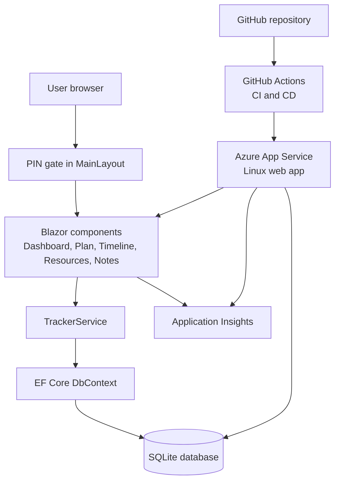

## System overview

This diagram shows the main runtime and delivery path for the training tracker.

## Runtime notes

* The user opens the Blazor web app and passes through a simple client-side PIN gate.
* Interactive Razor components render the dashboard and editable tracker tabs.
* `TrackerService` handles reads and writes for training items, resources, and notes.
* EF Core persists data to a local SQLite database.
* Azure App Service hosts the application, while Application Insights captures telemetry.
* GitHub Actions builds the app and deploys changes from `main` to the production web app.
