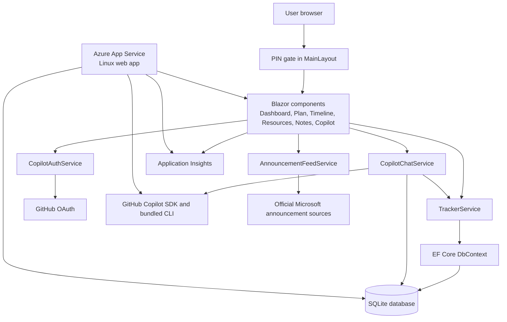
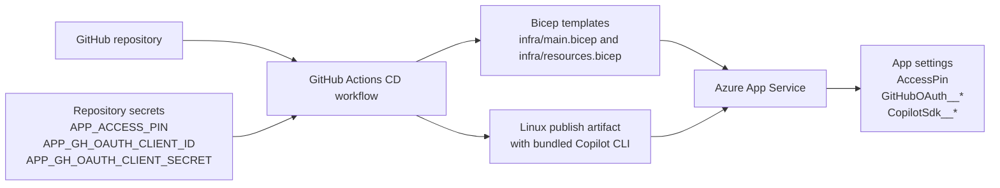

## System overview

This diagram shows the current application runtime, including the live feed and
the grounded GitHub Copilot chat path.

## Runtime notes

* The user opens the Blazor web app and passes through a simple client-side PIN gate.
* Interactive Razor components render the dashboard, editable tracker tabs, and the Copilot chat workspace.
* The home view and dashboard summary cards are driven by tracker data so the shell avoids stale fixed date ranges and static campaign copy.
* `AnnouncementFeedService` loads and memory-caches official Microsoft announcement sources for the dashboard feed.
* `TrackerService` handles reads and writes for training items, resources, and notes.
* `CopilotAuthService` and `CopilotChatService` manage GitHub OAuth, runtime model discovery, and grounded Copilot interactions.
* EF Core persists data to a local SQLite database.
* Azure App Service hosts the application, while Application Insights captures telemetry.

## Delivery and configuration flow

This diagram shows how source changes and secure settings flow into Azure.

## Delivery notes

* GitHub Actions builds and publishes the app for `linux-x64`.
* The published artifact includes the platform-matching Copilot CLI required by the .NET SDK on Azure App Service.
* The CD workflow passes PIN, GitHub OAuth, and Copilot model settings into Bicep so Azure app settings remain aligned with source-controlled infrastructure.
