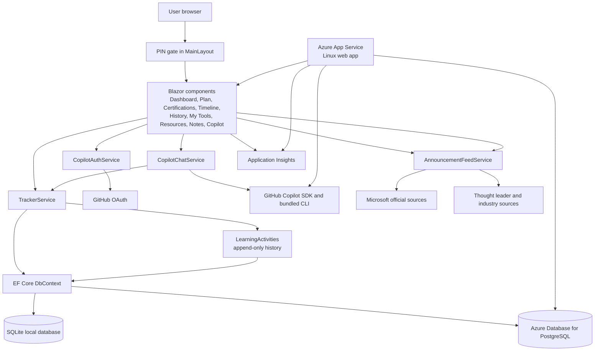
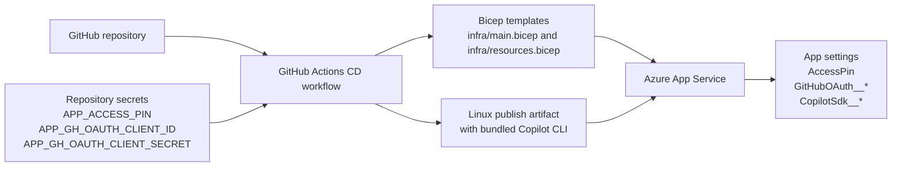

## System overview

This diagram shows the current application runtime, including the live feed and
the grounded GitHub Copilot chat path.

```mermaid
flowchart TB
    User[User browser]
    Pin[PIN gate in MainLayout]
  UI[Blazor components\nDashboard, Plan, Certifications, Timeline,\nHistory, My Tools, Resources, Notes, Copilot]
  Tracker[TrackerService]
  Activity[LearningActivities\nappend-only history]
  Feed[AnnouncementFeedService]
  Auth[CopilotAuthService]
  Chat[CopilotChatService]
  GitHubOAuth[GitHub OAuth]
  CopilotSdk[GitHub Copilot SDK and bundled CLI]
    Data[EF Core DbContext]
    Sqlite[(SQLite local database)]
    Postgres[(Azure Database for PostgreSQL)]
    AppInsights[Application Insights]
  MicrosoftNews[Microsoft official sources]
  IndustryNews[Thought leader and industry sources]
  AppService[Azure App Service\nLinux web app]

    User --> Pin --> UI
  UI --> Tracker --> Data
  Data --> Sqlite
  Data --> Postgres
  Tracker --> Activity --> Data
  UI --> Feed --> MicrosoftNews
  UI --> Feed --> IndustryNews
  UI --> Auth --> GitHubOAuth
  UI --> Chat --> CopilotSdk
  Chat --> Tracker
    UI --> AppInsights
    AppService --> UI
    AppService --> Postgres
    AppService --> AppInsights
  AppService --> CopilotSdk
```

## Runtime notes

* Server-side PIN authorization protects pages, HTTP mutations, OAuth entry points, and each inbound Blazor circuit event. `PinGate` renders native antiforgery-protected forms, not a browser-side authorization flag.
* The portal's expiring, revocable cookie session is separate from the GitHub identity used by Copilot. Session/rate-limit state is process-local; restarting requires PIN re-entry.
* Interactive Razor components render the actionable dashboard, editable tracker tabs, Learning History, personal tools, and the Copilot chat workspace.
* `LearningStudio` turns tracker data into a ranked next step, a visual learning/applying/recalling session guide, a topic progress map, and browser-local weekly activity.
* Recall reflections reuse the Notes table and existing History recorder, with exact training-item/confidence tags and self-assessed review intervals based on the reflection's local creation day.
* Home owns temporary recall drafts across bookmarkable tab changes. Completing an in-flight save only clears the submitted draft and refreshes the currently mounted Dashboard.
* `AnnouncementFeedService` loads and memory-caches two announcement streams: official Microsoft sources and curated thought-leader or industry sources.
* `TrackerService` handles reads and writes for training items, resources, notes, and append-only learning activity.
* Provider-specific conflict-safe activity inserts prevent duplicate tracking events from breaking the primary user action.
* `DatabaseInitializer` explicitly creates and indexes `LearningActivities` for existing SQLite and PostgreSQL databases, then performs a one-time backfill from available historical timestamps.
* `CopilotAuthService` and `CopilotChatService` manage GitHub OAuth, runtime model discovery, and grounded Copilot interactions.
* EF Core persists local data to SQLite and production data to Azure Database for PostgreSQL Flexible Server.
* Azure App Service hosts the application, while Application Insights captures telemetry.

## Delivery and configuration flow

This diagram shows how source changes and secure settings flow into Azure.

```mermaid
flowchart LR
  Repo[GitHub repository]
  Workflow[GitHub Actions CD workflow]
  Secrets[Repository secrets\nAPP_ACCESS_PIN\nAPP_GH_OAUTH_CLIENT_ID\nAPP_GH_OAUTH_CLIENT_SECRET]
  Bicep[Bicep templates\ninfra/main.bicep and infra/resources.bicep]
  Package[Linux publish artifact\nwith bundled Copilot CLI]
  Azure[Azure App Service]
  Settings[App settings\nAccessPin\nGitHubOAuth__*\nCopilotSdk__*]

  Repo --> Workflow
  Secrets --> Workflow
  Workflow --> Bicep --> Azure
  Workflow --> Package --> Azure
  Azure --> Settings
```

## Delivery notes

* CD requires the reusable CI job's build, .NET regressions, Bicep compilation, and isolated browser journeys before publishing for `linux-x64`.
* Serialized production deployment checks that the commit is still current on main, then polls an uncached database/schema readiness endpoint for that exact build.
* The published artifact includes the platform-matching Copilot CLI required by the .NET SDK on Azure App Service.
* The CD workflow passes PIN, GitHub OAuth, and Copilot model settings into Bicep so Azure app settings remain aligned with source-controlled infrastructure.
* Infrastructure runs on relevant changes or a manual force switch. Existing TLS thumbprints are preserved, and Actions provisions/binds a managed certificate when necessary before confirming custom-domain HTTPS.
